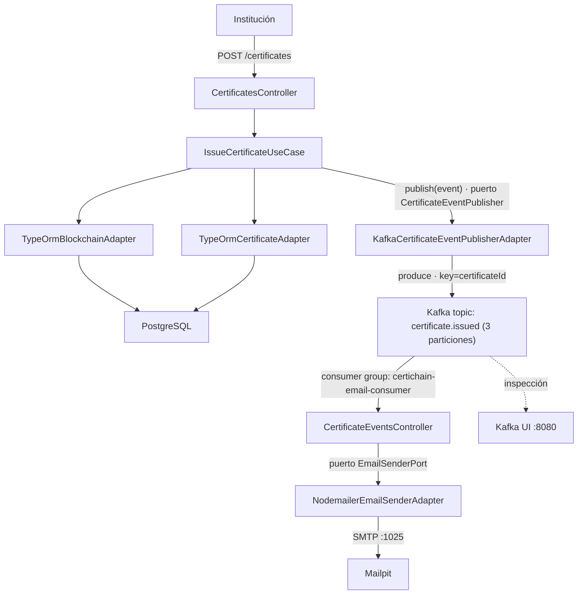

# Integración de Apache Kafka en CertiChain

## Índice

1. [Contexto](#1-contexto)
2. [Por qué usar Kafka (y en qué se diferencia de RabbitMQ)](#2-por-qué-usar-kafka-y-en-qué-se-diferencia-de-rabbitmq)
3. [Arquitectura de la solución](#3-arquitectura-de-la-solución)
4. [Diagrama de componentes](#4-diagrama-de-componentes)
5. [Estructura de archivos añadidos](#5-estructura-de-archivos-añadidos)
6. [Evento `certificate.issued`](#6-evento-certificateissued)
7. [Flujo de ejemplo paso a paso](#7-flujo-de-ejemplo-paso-a-paso)
8. [Variables de entorno](#8-variables-de-entorno)
9. [Cómo ejecutar el proyecto en local](#9-cómo-ejecutar-el-proyecto-en-local)
10. [Comandos útiles de Kafka](#10-comandos-útiles-de-kafka)

---

## 1. Contexto

CertiChain emite certificados académicos, los ancla en una blockchain propia y los persiste en PostgreSQL. Para notificar al alumno por correo sin acoplar ni bloquear el flujo HTTP de emisión, se incorporó **Apache Kafka** como plataforma de streaming de eventos, siguiendo la arquitectura hexagonal ya existente en el proyecto (puertos/adaptadores).

El envío de correo se ejecuta **después** de que el certificado ya fue emitido y anclado, mediante un evento de dominio publicado en un *topic* de Kafka y consumido por un componente independiente dentro del mismo proceso de NestJS.

Esta rama (`feature/certichain-kafka`) es el espejo de `feature/certichain-rabbitmq`: **el core y los puertos son idénticos**, solo cambian los adaptadores de mensajería y la infraestructura. Eso demuestra el valor de la arquitectura hexagonal: el broker es un detalle de infraestructura intercambiable.

---

## 2. Por qué usar Kafka (y en qué se diferencia de RabbitMQ)

| Ventaja | Descripción |
|---|---|
| **Desacoplamiento** | `IssueCertificateUseCase` no conoce el broker. Solo publica un evento a través del puerto outbound `CertificateEventPublisher`. |
| **No bloqueante** | La respuesta HTTP de `POST /certificates` no espera al envío del correo. `ClientKafka.emit()` es *fire-and-forget*. |
| **Log persistente y re-lectura** | Kafka no borra el mensaje cuando se consume: lo guarda en el log del topic (por defecto 7 días). Un consumidor nuevo puede "rebobinar" y reprocesar eventos históricos (auditoría, reconstrucción de estado). |
| **Orden por partición** | Usamos `certificateId` como *key* del mensaje, así todos los eventos de un mismo certificado caen en la misma partición y se procesan en orden. |
| **Escalabilidad horizontal** | Varias instancias del consumidor con el mismo `groupId` se reparten automáticamente las particiones del topic. |
| **Múltiples consumidores independientes** | Cada *consumer group* lleva su propio offset: un futuro grupo de "auditoría" leería el mismo topic sin afectar al grupo de correos. |
| **Tolerancia a fallos aislada** | Un error en el SMTP no afecta la persistencia del certificado ni el registro en blockchain, que ya ocurrieron antes de publicar el evento. |

### Comparación rápida

| Aspecto | RabbitMQ (rama del compañero) | Kafka (esta rama) |
|---|---|---|
| Modelo | Cola: el broker *empuja* mensajes y los borra al ser confirmados (ACK). | Log distribuido: el consumidor *lee* por offset; el mensaje se conserva según retención. |
| Unidad de enrutamiento | Exchange + routing key → cola. | Topic → particiones (por *key*). |
| Transporte NestJS | `Transport.RMQ` (`amqplib`) | `Transport.KAFKA` (`kafkajs`) |
| Escalado del consumidor | Varios consumidores compiten por la misma cola. | Consumer group: cada partición la lee una sola instancia del grupo. |
| Reprocesar eventos | No (salvo re-publicar). | Sí, moviendo el offset del grupo. |
| Panel web | Management plugin (`:15672`) | Kafka UI (`:8080`) |
| Caso de uso ideal | Tareas/colas de trabajo, RPC, enrutamiento complejo. | Event streaming, alto volumen, múltiples lectores, historial de eventos. |

---

## 3. Arquitectura de la solución

Se respetó la arquitectura hexagonal existente, agregando:

- **Puerto outbound** `CertificateEventPublisher` — contrato para publicar eventos de integración (agnóstico del broker).
- **Puerto outbound** `EmailSenderPort` — contrato para el envío de correos.
- **Adaptador outbound** `KafkaCertificateEventPublisherAdapter` — implementa el puerto usando `@nestjs/microservices` (`ClientKafka` sobre `kafkajs`).
- **Adaptador outbound** `NodemailerEmailSenderAdapter` — implementa el puerto usando Nodemailer sobre SMTP.
- **Adaptador inbound (mensajería)** `CertificateEventsController` — consumidor Kafka (`@EventPattern('certificate.issued')`) que invoca al `EmailSenderPort`.
- **Configuración** `configuration/messaging/kafka.config.ts` — opciones compartidas por producer y consumer (brokers, `clientId`, `groupId`).

El `IssueCertificateUseCase` (capa de aplicación) sigue siendo una clase pura sin decoradores de NestJS: recibe el publicador por inyección de dependencias vía el *composition root* (`app.module.ts`), igual que los repositorios y el ledger de blockchain.

---

## 4. Diagrama de componentes



---

## 5. Estructura de archivos añadidos

```text
src/
  ports/
    outbound/
      certificate-event-publisher.port.ts   # Contrato + tipos del evento (sin dependencia del broker)
      email-sender.port.ts                  # Contrato de envío de correo
  adapters/
    outbound/
      messaging/
        kafka-certificate-event-publisher.adapter.ts   # Producer Kafka
      email/
        nodemailer-email-sender.adapter.ts             # Envío SMTP
    inbound/
      messaging/
        certificate-events.controller.ts   # Consumer Kafka
  configuration/
    messaging/
      kafka.config.ts                      # Brokers, clientId, groupId (compartido)
docker-compose.yml                         # Kafka (KRaft) + Kafka UI + Mailpit
.env.example                               # Variables de entorno documentadas
```

Modificados:

- `core/application/dto/certichain.dto.ts` — `IssueCertificateInput` agrega `holderEmail`.
- `core/application/use-cases/issue-certificate.use-case.ts` — publica el evento tras persistir el certificado.
- `adapters/inbound/rest/dtos/requests.dto.ts` — `IssueCertificateRequest` agrega `holderEmail` (`@IsEmail`).
- `configuration/dependency-injection/app.module.ts` — registra `ClientsModule` con `Transport.KAFKA`, providers de mensajería/correo y el controller consumidor.
- `main.ts` — conecta el microservicio Kafka (`connectMicroservice`) y carga `.env` antes de resolver `AppModule`.
- `package.json` — agrega `@nestjs/microservices`, `kafkajs`, `nodemailer`.

---

## 6. Evento `certificate.issued`

Publicado una vez que el certificado fue emitido, anclado en blockchain y persistido. En Kafka el mensaje se envía con:

- **topic**: `certificate.issued`
- **key**: `certificateId` (garantiza orden por certificado)
- **headers**: `eventId`, `eventType`
- **value**:

```json
{
  "eventId": "b2b0f1b4-...",
  "eventType": "certificate.issued",
  "occurredAt": "2026-08-27T22:17:02.000Z",
  "data": {
    "certificateId": "9f2e1c4a-...",
    "institutionId": "0b6c9a3e-...",
    "holderName": "María Fernanda Quispe",
    "holderEmail": "maria@example.com",
    "degreeTitle": "Ingeniera de Software",
    "verificationCode": "9f2e1c4a-...",
    "verificationUrl": "http://localhost:3000/verify/9f2e1c4a-...",
    "issuedAt": "2026-08-27T22:17:00.000Z"
  }
}
```

---

## 7. Flujo de ejemplo paso a paso

1. La institución llama a `POST /certificates` con `holderEmail`.
2. `CertificatesController` (adaptador inbound REST) delega en `IssueCertificateUseCase`.
3. El caso de uso valida, calcula el hash, ancla el bloque y persiste el certificado.
4. El caso de uso llama a `eventPublisher.publish(event)` (puerto outbound). **Aquí ya se responde `201 Created`** al cliente; lo que sigue es asíncrono.
5. `KafkaCertificateEventPublisherAdapter` produce el mensaje en el topic `certificate.issued` con key `certificateId`.
6. Kafka lo escribe en una partición (según hash de la key) y lo conserva en el log.
7. `CertificateEventsController`, miembro del consumer group `certichain-email-consumer`, recibe el mensaje.
8. El consumidor llama a `EmailSenderPort.sendCertificateEmail(...)`.
9. `NodemailerEmailSenderAdapter` envía el correo por SMTP a Mailpit.
10. El alumno recibe el correo con el enlace de verificación. El offset del grupo avanza.

Si el SMTP falla, el error se registra en consola; el certificado ya está emitido y el evento sigue disponible en Kafka para reintentos/reprocesamiento.

---

## 8. Variables de entorno

| Variable | Default | Descripción |
|---|---|---|
| `KAFKA_BROKERS` | `localhost:9092` | Lista de brokers separados por coma. |
| `KAFKA_CLIENT_ID` | `certichain-api` | Identificador de esta app ante el broker. |
| `KAFKA_GROUP_ID` | `certichain-email-consumer` | Consumer group del consumidor de correos. |
| `KAFKA_TOPIC` | `certificate.issued` | Topic del evento. |
| `SMTP_HOST` / `SMTP_PORT` | `localhost` / `1025` | Servidor SMTP (Mailpit local). |
| `SMTP_USER` / `SMTP_PASS` | — | Solo si el SMTP requiere autenticación. |
| `VERIFICATION_BASE_URL` | `http://localhost:3000/verify` | Base del enlace de verificación en el correo. |
| `DATABASE_URL_PG` | — | Conexión PostgreSQL (ya existente). |

Ver `.env.example`.

---

## 9. Cómo ejecutar el proyecto en local

```bash
# 1. Infraestructura: Kafka (KRaft, sin Zookeeper) + Kafka UI + Mailpit
docker compose up -d
docker compose ps          # kafka debe quedar "healthy"

# 2. Dependencias y variables de entorno
pnpm install
cp .env.example .env       # ajustar DATABASE_URL_PG si aplica

# 3. Levantar la API (HTTP + consumidor Kafka en el mismo proceso)
pnpm start:dev
```

Al arrancar verás en consola:

```text
🎓 API de CertiChain escuchando en http://localhost:3000
📄 Swagger UI disponible en http://localhost:3000/api
📨 Consumidor Kafka escuchando el topic "certificate.issued" (brokers: localhost:9092)
```

Prueba:

```bash
# Registrar institución
curl -s -X POST http://localhost:3000/institutions \
  -H 'Content-Type: application/json' \
  -d '{"name":"Universidad Nacional de Ingeniería"}'

# Emitir certificado (usar el id devuelto arriba)
curl -s -X POST http://localhost:3000/certificates \
  -H 'Content-Type: application/json' \
  -d '{
    "institutionId": "<id>",
    "holderName": "María Fernanda Quispe",
    "holderDocument": "74125836",
    "holderEmail": "maria@example.com",
    "degreeTitle": "Ingeniera de Software"
  }'
```

Luego:

- **Kafka UI** → http://localhost:8080 → Topics → `certificate.issued` → Messages: verás el evento, su key y partición.
- **Mailpit** → http://localhost:8025: verás el correo enviado a `maria@example.com`.
- Consola de NestJS: `📥 Evento certificate.issued recibido (eventId=..., topic=certificate.issued, partition=N)`.

---

## 10. Comandos útiles de Kafka

```bash
# Listar topics
docker exec certichain-kafka /opt/kafka/bin/kafka-topics.sh --bootstrap-server localhost:9092 --list

# Describir el topic (particiones, líder)
docker exec certichain-kafka /opt/kafka/bin/kafka-topics.sh --bootstrap-server localhost:9092 --describe --topic certificate.issued

# Consumir desde el inicio (ver historial de eventos)
docker exec certichain-kafka /opt/kafka/bin/kafka-console-consumer.sh \
  --bootstrap-server localhost:9092 --topic certificate.issued --from-beginning --property print.key=true

# Ver offsets/lag del consumer group
docker exec certichain-kafka /opt/kafka/bin/kafka-consumer-groups.sh \
  --bootstrap-server localhost:9092 --describe --group certichain-email-consumer

# Reprocesar todos los eventos (con la API detenida): resetear offset al inicio
docker exec certichain-kafka /opt/kafka/bin/kafka-consumer-groups.sh \
  --bootstrap-server localhost:9092 --group certichain-email-consumer \
  --topic certificate.issued --reset-offsets --to-earliest --execute
```
