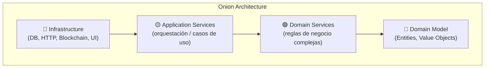
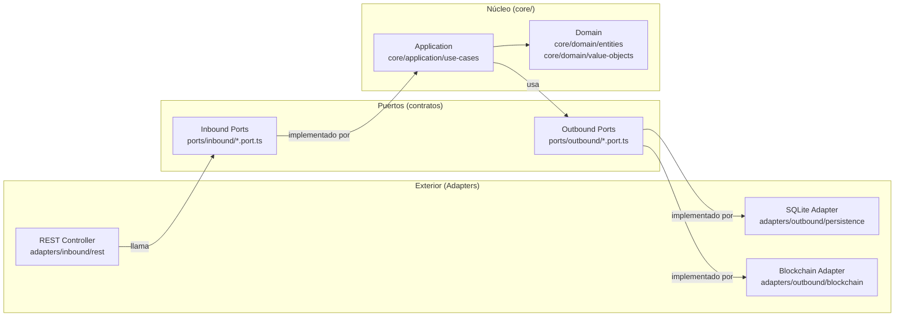
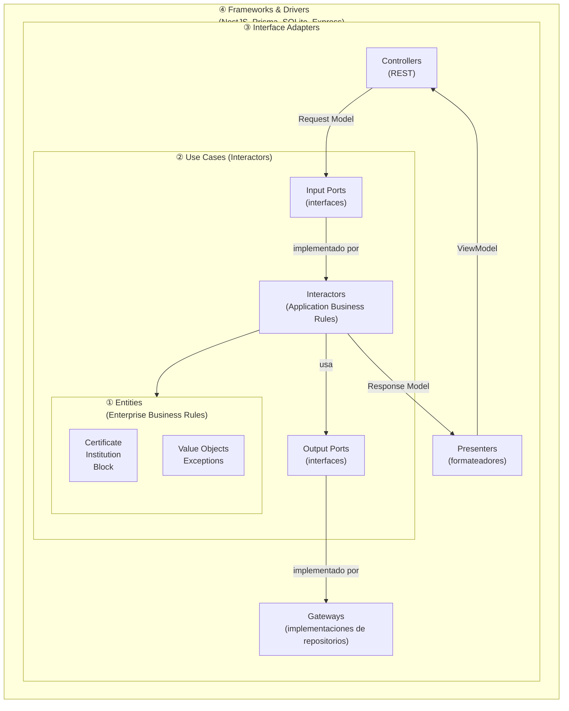
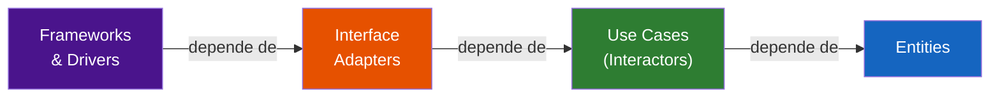
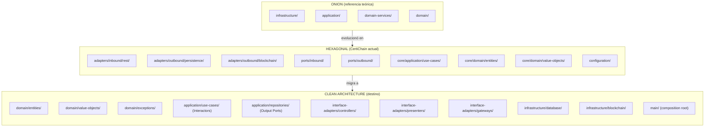
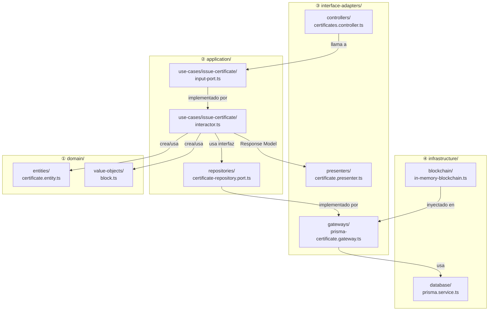
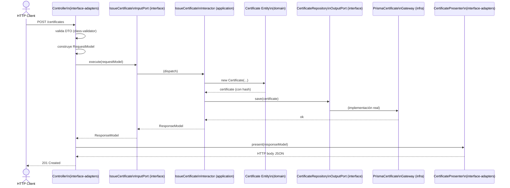
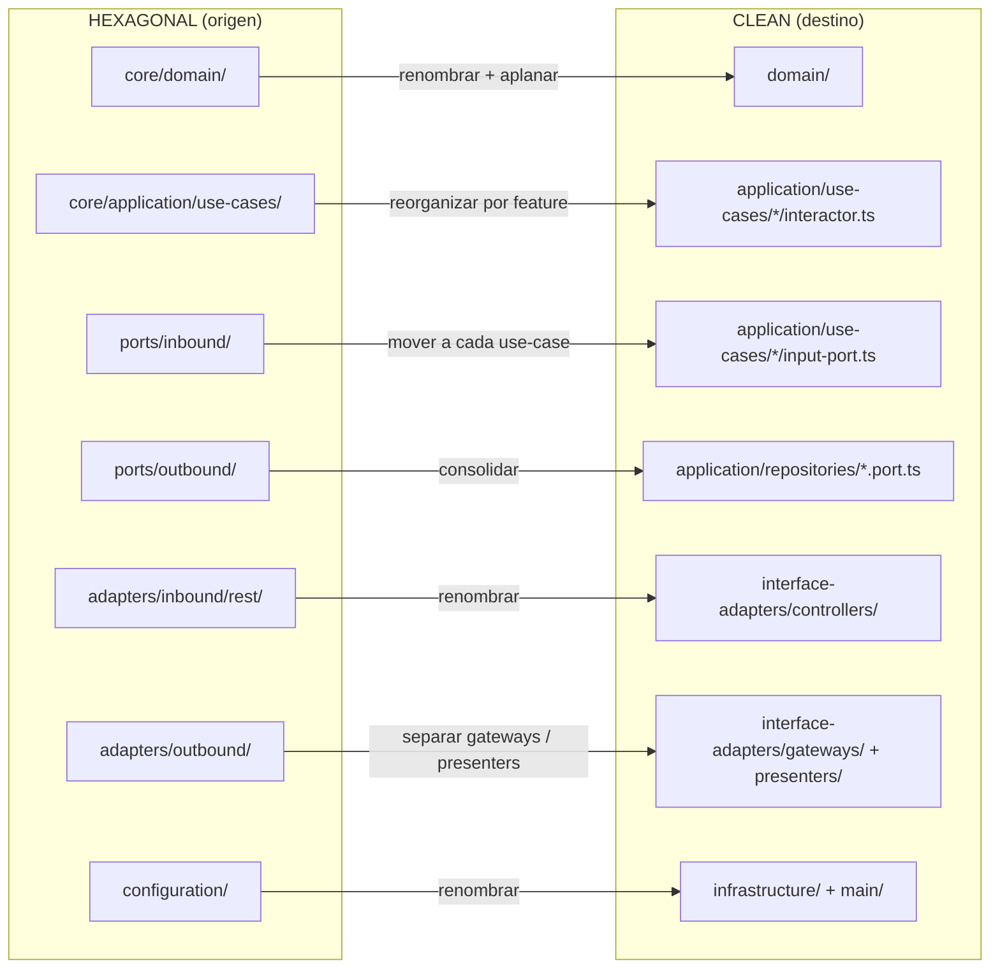
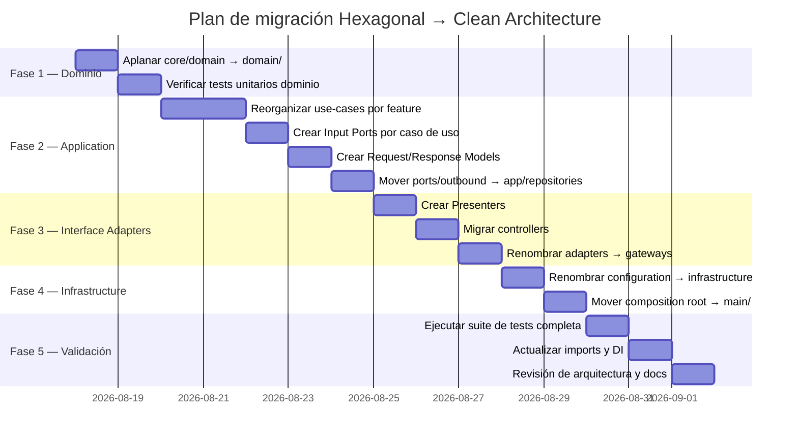

# Migración de Arquitectura Hexagonal a Clean Architecture — CertiChain

**Documento técnico de análisis y planificación de migración**

| | |
|---|---|
| **Proyecto** | CertiChain — Registro y Verificación de Certificados |
| **Arquitectura origen** | Hexagonal (Ports & Adapters) |
| **Arquitectura destino** | Clean Architecture (Uncle Bob) |
| **Stack** | TypeScript + NestJS |
| **Fecha** | Agosto de 2026 |

---

## Tabla de Contenidos

1. [Comparativa arquitectónica](#1-comparativa-arquitectónica)
2. [Descripción visual de cada arquitectura](#2-descripción-visual-de-cada-arquitectura)
3. [Evolución de la estructura: Onion → Hexagonal → Clean](#3-evolución-de-la-estructura-onion--hexagonal--clean)
4. [Nueva estructura con Clean Architecture](#4-nueva-estructura-con-clean-architecture)
5. [Cambios principales para la migración](#5-cambios-principales-para-la-migración)
6. [Mapeo de artefactos: actual → futuro](#6-mapeo-de-artefactos-actual--futuro)
7. [Ejemplo de caso de uso migrado](#7-ejemplo-de-caso-de-uso-migrado)
8. [Plan de migración incremental](#8-plan-de-migración-incremental)

---

## 1. Comparativa arquitectónica

### 1.1 Cuadro comparativo: Onion vs Hexagonal vs Clean Architecture

| Criterio | Onion Architecture | Hexagonal Architecture (Ports & Adapters) | Clean Architecture |
|---|---|---|---|
| **Autor / Origen** | Jeffrey Palermo (2008) | Alistair Cockburn (2005) | Robert C. Martin / Uncle Bob (2012) |
| **Metáfora visual** | Capas concéntricas (cebolla) | Hexágono con puertos en los lados | Círculos concéntricos con flecha de dependencia |
| **Regla principal** | Las dependencias apuntan hacia el centro | El dominio no conoce nada del exterior; los puertos son la frontera | _Dependency Rule_: el código fuente solo puede apuntar hacia adentro |
| **Separación de capas** | Domain Model → Domain Services → App Services → Infrastructure | Núcleo (domain + application) ↔ Ports ↔ Adapters | Entities → Use Cases → Interface Adapters → Frameworks & Drivers |
| **Entidades vs Casos de uso** | No los separa explícitamente (ambos en el núcleo) | No los separa explícitamente (ambos en `core/`) | **Los separa explícitamente**: Entities = reglas de empresa; Use Cases = reglas de aplicación |
| **Puertos / Contratos** | Interfaces en capas internas | Puertos inbound (driving) y outbound (driven) formalmente nombrados | Input Ports (interfaces del caso de uso) y Output Ports (repositorios/servicios externos) |
| **Presenters** | No existe el concepto explícito | No existe el concepto explícito | **Explícito**: un Presenter formatea la respuesta del caso de uso para la vista |
| **Organización del código** | Por capas (layer-first) | Por capas (layer-first) con terminología de puertos | "Screaming Architecture": por feature/caso de uso (feature-first opcional) |
| **Testabilidad** | Alta (núcleo sin dependencias externas) | Alta (mocks de adaptadores) | Muy alta (cada capa se prueba aislada; Use Cases no conocen UI ni DB) |
| **Curva de aprendizaje** | Media | Media-alta (terminología específica) | Alta (varios patrones: Interactor, Presenter, Request/Response Model) |
| **Boilerplate** | Moderado | Moderado | Alto (más archivos por caso de uso) |
| **Flexibilidad de UI** | Moderada | Alta (múltiples adaptadores inbound) | Muy alta (el Presenter desacopla completamente la UI) |
| **Flexibilidad de infraestructura** | Alta | Muy alta (intercambio de adaptadores) | Muy alta |
| **Popularidad en ecosistema NestJS** | Alta | Muy alta | Media-alta (frecuente en proyectos grandes) |

### 1.2 Ventajas y desventajas

| | Onion | Hexagonal | Clean Architecture |
|---|---|---|---|
| **✅ Ventajas** | Simple de entender · Flujo claro de dependencias · Buena para CRUD empresarial | Facilita múltiples fronteras (REST + CLI + MQ) · Permite intercambiar infra sin tocar el core · Terminología precisa | Separación máxima de responsabilidades · Cada componente es 100 % independiente · Los Use Cases describen la intención del sistema · Ideal para equipos grandes |
| **❌ Desventajas** | No separa explícitamente reglas de empresa vs reglas de aplicación · Puede colapsar capas con el tiempo | La frontera `ports/` puede crecer desordenada · No define cómo presentar la salida al cliente | Alto volumen de archivos por feature · El patrón Presenter puede sentirse excesivo para APIs simples · Mayor tiempo inicial de diseño |
| **📌 Casos de uso ideales** | Aplicaciones empresariales con lógica de dominio moderada · Proyectos que migran de MVC y quieren separar la lógica de negocio | Sistemas con múltiples tipos de clientes (REST, CLI, workers) · Blockchain o infra intercambiable · Proyectos medianos-grandes con requisito de testabilidad alta | Sistemas de misión crítica o larga vida útil · Equipos grandes donde distintos grupos tocan capas distintas · Cuando la UI puede cambiar radicalmente (web → mobile → CLI) |

---

## 2. Descripción visual de cada arquitectura

### 2.1 Onion Architecture



### 2.2 Hexagonal Architecture (estado actual del proyecto)



### 2.3 Clean Architecture (destino)



### 2.4 La Dependency Rule (regla fundamental)



> **Regla de oro**: ninguna flecha apunta hacia afuera. El código fuente de una capa interna jamás menciona el nombre de algo de una capa exterior.

---

## 3. Evolución de la estructura: Onion → Hexagonal → Clean

### 3.1 Diagrama de evolución estructural



### 3.2 Qué cambió en cada salto

| Salto | Qué se ganó | Qué se perdió / agregó |
|---|---|---|
| **Onion → Hexagonal** | Puertos explícitos como contratos · Terminología precisa (inbound/outbound) · Múltiples adaptadores por puerto | Mayor número de archivos · Terminología nueva que el equipo debe aprender |
| **Hexagonal → Clean** | Separación explícita Entities/Use Cases · Presenters para desacoplar la respuesta · Request/Response Models · Screaming Architecture (el código "grita" lo que hace el sistema) | Más boilerplate · Carpetas por caso de uso en lugar de una sola carpeta `use-cases/` |

---

## 4. Nueva estructura con Clean Architecture

### 4.1 Árbol de directorios propuesto

```
src/
│
├── domain/                              ← ① ENTITIES (Enterprise Business Rules)
│   ├── entities/
│   │   ├── certificate.entity.ts
│   │   └── institution.entity.ts
│   ├── value-objects/
│   │   └── block.ts
│   └── exceptions/
│       └── domain.errors.ts
│
├── application/                         ← ② USE CASES (Application Business Rules)
│   ├── use-cases/
│   │   ├── issue-certificate/
│   │   │   ├── issue-certificate.interactor.ts   ← implementación del caso de uso
│   │   │   ├── issue-certificate.input-port.ts   ← interface (Input Port)
│   │   │   ├── issue-certificate.output-port.ts  ← interface (Output Port)
│   │   │   ├── issue-certificate.request.ts      ← Request Model (datos de entrada)
│   │   │   └── issue-certificate.response.ts     ← Response Model (datos de salida)
│   │   ├── verify-certificate/
│   │   │   ├── verify-certificate.interactor.ts
│   │   │   ├── verify-certificate.input-port.ts
│   │   │   ├── verify-certificate.request.ts
│   │   │   └── verify-certificate.response.ts
│   │   ├── revoke-certificate/
│   │   │   └── ...
│   │   ├── register-institution/
│   │   │   └── ...
│   │   ├── list-holder-certificates/
│   │   │   └── ...
│   │   └── verify-chain/
│   │       └── ...
│   └── repositories/                    ← contratos de repositorios (Output Ports)
│       ├── certificate-repository.port.ts
│       ├── institution-repository.port.ts
│       ├── certificate-ledger.port.ts
│       └── clock.port.ts
│
├── interface-adapters/                  ← ③ INTERFACE ADAPTERS
│   ├── controllers/
│   │   ├── certificates.controller.ts
│   │   ├── institutions.controller.ts
│   │   └── blockchain.controller.ts
│   ├── presenters/
│   │   ├── certificate.presenter.ts     ← convierte Response Model → HTTP response body
│   │   └── institution.presenter.ts
│   ├── gateways/                        ← implementaciones de Output Ports
│   │   ├── prisma-certificate.gateway.ts
│   │   ├── prisma-institution.gateway.ts
│   │   └── sqlite-blockchain.gateway.ts
│   └── dtos/
│       └── requests.dto.ts              ← validación de entrada (class-validator)
│
├── infrastructure/                      ← ④ FRAMEWORKS & DRIVERS
│   ├── database/
│   │   ├── prisma.service.ts
│   │   └── typeorm.config.ts
│   └── blockchain/
│       └── in-memory-blockchain.ts
│
└── main/                                ← Composition Root
    ├── app.module.ts
    └── main.ts
```

### 4.2 Diagrama de dependencias por módulo



### 4.3 Estructura de un caso de uso en Clean Architecture



---

## 5. Cambios principales para la migración

### 5.1 Resumen ejecutivo de cambios



### 5.2 Cambios detallados por capa

#### Cambio 1 — Aplanar y renombrar el núcleo

| Estado actual | Estado futuro | Justificación |
|---|---|---|
| `src/core/domain/entities/` | `src/domain/entities/` | Clean Architecture nombra la capa interna simplemente "Entities"; no necesita el prefijo `core/` |
| `src/core/domain/value-objects/` | `src/domain/value-objects/` | Idem |
| `src/core/domain/exceptions/` | `src/domain/exceptions/` | Idem |
| `src/core/application/dto/` | Se elimina (reemplazado por Request/Response Models por caso de uso) | Los modelos de entrada/salida son propios de cada Use Case, no compartidos |

#### Cambio 2 — Reorganizar use cases por feature (Screaming Architecture)

**Antes (Hexagonal):**
```
src/core/application/use-cases/
  issue-certificate.use-case.ts
  verify-certificate.use-case.ts
  revoke-certificate.use-case.ts
  register-institution.use-case.ts
  list-holder-certificates.use-case.ts
  verify-chain.use-case.ts
```

**Después (Clean Architecture):**
```
src/application/use-cases/
  issue-certificate/
    issue-certificate.interactor.ts      ← la clase (antes: use-case.ts)
    issue-certificate.input-port.ts      ← la interface de entrada
    issue-certificate.request.ts         ← datos de entrada tipados
    issue-certificate.response.ts        ← datos de salida tipados
  verify-certificate/
    verify-certificate.interactor.ts
    verify-certificate.input-port.ts
    verify-certificate.request.ts
    verify-certificate.response.ts
  ... (igual para cada caso de uso)
```

> **Beneficio**: al abrir `src/application/use-cases/` la carpeta "grita" las capacidades del sistema. Cada caso de uso es una unidad autónoma con su contrato, su implementación y sus modelos.

#### Cambio 3 — Separar puertos inbound de los Use Cases

| Estado actual | Estado futuro |
|---|---|
| `src/ports/inbound/issue-certificate.port.ts` | `src/application/use-cases/issue-certificate/issue-certificate.input-port.ts` |
| `src/ports/inbound/verify-certificate.port.ts` | `src/application/use-cases/verify-certificate/verify-certificate.input-port.ts` |
| *(igual para todos)* | *(igual para todos)* |

En Clean Architecture, el **Input Port** (la interface que el Controller invoca) vive dentro del módulo del Use Case, no en una carpeta `ports/` separada. Esto refuerza la cohesión por feature.

#### Cambio 4 — Consolidar puertos outbound como repositorios de aplicación

| Estado actual | Estado futuro |
|---|---|
| `src/ports/outbound/certificate-repository.port.ts` | `src/application/repositories/certificate-repository.port.ts` |
| `src/ports/outbound/institution-repository.port.ts` | `src/application/repositories/institution-repository.port.ts` |
| `src/ports/outbound/certificate-ledger.port.ts` | `src/application/repositories/certificate-ledger.port.ts` |
| `src/ports/outbound/clock.port.ts` | `src/application/repositories/clock.port.ts` |

Los Output Ports (repositorios / servicios externos) son **definidos por la capa de application** e implementados en `interface-adapters/gateways/`. Mover la carpeta `ports/outbound/` dentro de `application/repositories/` hace explícita la "propiedad" de estos contratos.

#### Cambio 5 — Introducir Presenters

En Hexagonal no existen los Presenters; el Controller construye directamente el response. En Clean Architecture se agrega una capa explícita:

```typescript
// interface-adapters/presenters/certificate.presenter.ts
import { IssueCertificateResponse } from '../../application/use-cases/issue-certificate/issue-certificate.response';

export class CertificatePresenter {
  static toHttpBody(response: IssueCertificateResponse) {
    return {
      verificationCode: response.verificationCode,
      contentHash: response.contentHash,
      issuedAt: response.issuedAt,
      holderName: response.holderName,
      status: response.status,
      _links: {
        verify: `/certificates/${response.verificationCode}/verify`,
      },
    };
  }
}
```

> **Beneficio**: si mañana se expone una API GraphQL o gRPC, el Interactor no cambia; solo se agrega un nuevo Presenter y Controller.

#### Cambio 6 — Renombrar Adapters outbound → Gateways

| Estado actual | Estado futuro |
|---|---|
| `adapters/outbound/persistence/sqlite-certificate.adapter.ts` | `interface-adapters/gateways/prisma-certificate.gateway.ts` |
| `adapters/outbound/persistence/sqlite-institution.adapter.ts` | `interface-adapters/gateways/prisma-institution.gateway.ts` |
| `adapters/outbound/blockchain/sqlite-blockchain.adapter.ts` | `interface-adapters/gateways/sqlite-blockchain.gateway.ts` |
| `adapters/outbound/clock/system-clock.adapter.ts` | `interface-adapters/gateways/system-clock.gateway.ts` |

El término "Gateway" (en lugar de "Adapter") es la terminología de Uncle Bob para las implementaciones de Output Ports en la capa de Interface Adapters.

#### Cambio 7 — Renombrar configuration/ → infrastructure/ + main/

| Estado actual | Estado futuro |
|---|---|
| `configuration/database/prisma.service.ts` | `infrastructure/database/prisma.service.ts` |
| `configuration/database/typeorm.config.ts` | `infrastructure/database/typeorm.config.ts` |
| `configuration/dependency-injection/app.module.ts` | `main/app.module.ts` |
| `src/main.ts` | `main/main.ts` |

---

## 6. Mapeo de artefactos: actual → futuro

### 6.1 Tabla completa de mapeo

```mermaid
graph TD
    subgraph Actual["Estructura Hexagonal Actual"]
        A1["src/core/domain/entities/certificate.entity.ts"]
        A2["src/core/domain/entities/institution.entity.ts"]
        A3["src/core/domain/value-objects/block.ts"]
        A4["src/core/domain/exceptions/domain.errors.ts"]
        A5["src/core/application/use-cases/issue-certificate.use-case.ts"]
        A6["src/core/application/dto/certichain.dto.ts"]
        A7["src/ports/inbound/issue-certificate.port.ts"]
        A8["src/ports/outbound/certificate-repository.port.ts"]
        A9["src/adapters/inbound/rest/certificates.controller.ts"]
        A10["src/adapters/outbound/persistence/sqlite-certificate.adapter.ts"]
        A11["src/configuration/dependency-injection/app.module.ts"]
    end

    subgraph Futuro["Estructura Clean Architecture Destino"]
        B1["src/domain/entities/certificate.entity.ts"]
        B2["src/domain/entities/institution.entity.ts"]
        B3["src/domain/value-objects/block.ts"]
        B4["src/domain/exceptions/domain.errors.ts"]
        B5["src/application/use-cases/issue-certificate/issue-certificate.interactor.ts"]
        B6a["src/application/use-cases/issue-certificate/issue-certificate.request.ts"]
        B6b["src/application/use-cases/issue-certificate/issue-certificate.response.ts"]
        B7["src/application/use-cases/issue-certificate/issue-certificate.input-port.ts"]
        B8["src/application/repositories/certificate-repository.port.ts"]
        B9["src/interface-adapters/controllers/certificates.controller.ts"]
        B9p["src/interface-adapters/presenters/certificate.presenter.ts"]
        B10["src/interface-adapters/gateways/prisma-certificate.gateway.ts"]
        B11["src/main/app.module.ts"]
    end

    A1 --> B1
    A2 --> B2
    A3 --> B3
    A4 --> B4
    A5 --> B5
    A6 --> B6a
    A6 --> B6b
    A7 --> B7
    A8 --> B8
    A9 --> B9
    A9 -.->|"nuevo artefacto"| B9p
    A10 --> B10
    A11 --> B11
```



---

## 7. Ejemplo de caso de uso migrado

### 7.1 `IssueCertificate` en Hexagonal (actual)

```typescript
// src/core/application/use-cases/issue-certificate.use-case.ts
export class IssueCertificateUseCase {
  constructor(
    private readonly institutions: InstitutionRepository,  // ports/outbound
    private readonly certificates: CertificateRepository, // ports/outbound
    private readonly ledger: CertificateLedger,           // ports/outbound
    private readonly clock: Clock,                         // ports/outbound
  ) {}

  async execute(input: IssueCertificateInput): Promise<IssueCertificateOutput> {
    // lógica...
  }
}
```

### 7.2 `IssueCertificate` en Clean Architecture (destino)

**Input Port (contrato):**
```typescript
// src/application/use-cases/issue-certificate/issue-certificate.input-port.ts
import { IssueCertificateRequest } from './issue-certificate.request';
import { IssueCertificateResponse } from './issue-certificate.response';

export interface IssueCertificateInputPort {
  execute(request: IssueCertificateRequest): Promise<IssueCertificateResponse>;
}
```

**Request Model:**
```typescript
// src/application/use-cases/issue-certificate/issue-certificate.request.ts
export interface IssueCertificateRequest {
  readonly institutionId: string;
  readonly holderName: string;
  readonly holderDocument: string;
  readonly degreeTitle: string;
}
```

**Response Model:**
```typescript
// src/application/use-cases/issue-certificate/issue-certificate.response.ts
export interface IssueCertificateResponse {
  readonly verificationCode: string;
  readonly contentHash: string;
  readonly issuedAt: string;
  readonly holderName: string;
  readonly status: string;
}
```

**Interactor (implementación):**
```typescript
// src/application/use-cases/issue-certificate/issue-certificate.interactor.ts
import { IssueCertificateInputPort } from './issue-certificate.input-port';
import { IssueCertificateRequest } from './issue-certificate.request';
import { IssueCertificateResponse } from './issue-certificate.response';
import { CertificateRepository } from '../../repositories/certificate-repository.port';
import { InstitutionRepository } from '../../repositories/institution-repository.port';
import { CertificateLedger } from '../../repositories/certificate-ledger.port';
import { Clock } from '../../repositories/clock.port';
import { Certificate } from '../../../domain/entities/certificate.entity';
import { InstitutionNotFoundError } from '../../../domain/exceptions/domain.errors';
import { randomUUID } from 'node:crypto';

export class IssueCertificateInteractor implements IssueCertificateInputPort {
  constructor(
    private readonly institutions: InstitutionRepository,
    private readonly certificates: CertificateRepository,
    private readonly ledger: CertificateLedger,
    private readonly clock: Clock,
  ) {}

  async execute(request: IssueCertificateRequest): Promise<IssueCertificateResponse> {
    const institution = await this.institutions.findById(request.institutionId);
    if (!institution) throw new InstitutionNotFoundError(request.institutionId);
    institution.ensureCanIssue();

    const certificate = new Certificate(
      randomUUID(),
      institution.id,
      request.holderName,
      request.holderDocument,
      request.degreeTitle,
      this.clock.now(),
    );

    await this.ledger.append({ type: 'EMISION', verificationCode: certificate.verificationCode,
      contentHash: certificate.contentHash, institutionId: institution.id,
      at: certificate.issuedAt.toISOString() });
    await this.certificates.save(certificate);

    return {
      verificationCode: certificate.verificationCode,
      contentHash: certificate.contentHash,
      issuedAt: certificate.issuedAt.toISOString(),
      holderName: certificate.holderName,
      status: certificate.status,
    };
  }
}
```

**Presenter:**
```typescript
// src/interface-adapters/presenters/certificate.presenter.ts
import { IssueCertificateResponse } from '../../application/use-cases/issue-certificate/issue-certificate.response';

export class CertificatePresenter {
  static toIssuedView(response: IssueCertificateResponse) {
    return {
      verificationCode: response.verificationCode,
      contentHash: response.contentHash,
      issuedAt: response.issuedAt,
      holderName: response.holderName,
      status: response.status,
      _links: { verify: `/certificates/${response.verificationCode}/verify` },
    };
  }
}
```

**Controller migrado:**
```typescript
// src/interface-adapters/controllers/certificates.controller.ts
import { Controller, Post, Body, HttpCode } from '@nestjs/common';
import { IssueCertificateInputPort } from '../../application/use-cases/issue-certificate/issue-certificate.input-port';
import { IssueCertificateRequest } from '../../application/use-cases/issue-certificate/issue-certificate.request';
import { CertificatePresenter } from '../presenters/certificate.presenter';
import { IssueCertificateDto } from '../dtos/requests.dto';

@Controller('certificates')
export class CertificatesController {
  constructor(private readonly issueUseCase: IssueCertificateInputPort) {}

  @Post()
  @HttpCode(201)
  async issue(@Body() dto: IssueCertificateDto) {
    const request: IssueCertificateRequest = {
      institutionId: dto.institutionId,
      holderName: dto.holderName,
      holderDocument: dto.holderDocument,
      degreeTitle: dto.degreeTitle,
    };
    const response = await this.issueUseCase.execute(request);
    return CertificatePresenter.toIssuedView(response);
  }
}
```

---

## 8. Plan de migración incremental

### 8.1 Fases de migración



### 8.2 Checklist de migración

- [ ] **Fase 1**: Mover `src/core/domain/` → `src/domain/` (sin cambiar código interno)
- [ ] **Fase 1**: Ejecutar `pnpm test` — todos los tests de dominio deben pasar
- [ ] **Fase 2**: Crear carpeta `src/application/use-cases/` con subcarpeta por caso de uso
- [ ] **Fase 2**: Para cada caso de uso, crear `*.input-port.ts`, `*.request.ts`, `*.response.ts`
- [ ] **Fase 2**: Renombrar `*UseCase` → `*Interactor` e implementar el Input Port
- [ ] **Fase 2**: Mover `src/ports/outbound/` → `src/application/repositories/`
- [ ] **Fase 3**: Crear `src/interface-adapters/presenters/` con un Presenter por entidad
- [ ] **Fase 3**: Mover `src/adapters/inbound/rest/` → `src/interface-adapters/controllers/`
- [ ] **Fase 3**: Mover `src/adapters/outbound/` → `src/interface-adapters/gateways/` (renombrar `*.adapter.ts` → `*.gateway.ts`)
- [ ] **Fase 4**: Mover `src/configuration/database/` → `src/infrastructure/database/`
- [ ] **Fase 4**: Mover `src/configuration/dependency-injection/app.module.ts` → `src/main/app.module.ts`
- [ ] **Fase 5**: Actualizar todos los `imports` en NestJS modules
- [ ] **Fase 5**: Ejecutar `pnpm build && pnpm test && pnpm run test:e2e`
- [ ] **Fase 5**: Verificar que ninguna capa interna importe de una capa exterior

### 8.3 Regla de validación de dependencias

Para verificar automáticamente que se respeta la Dependency Rule, se puede integrar [dependency-cruiser](https://github.com/sverweij/dependency-cruiser):

```json
// .dependency-cruiser.json
{
  "forbidden": [
    {
      "name": "domain-no-dep-outward",
      "comment": "domain/ no puede importar de application/, interface-adapters/ ni infrastructure/",
      "from": { "path": "^src/domain" },
      "to": { "path": "^src/(application|interface-adapters|infrastructure|main)" }
    },
    {
      "name": "application-no-dep-adapters",
      "comment": "application/ no puede importar de interface-adapters/ ni infrastructure/",
      "from": { "path": "^src/application" },
      "to": { "path": "^src/(interface-adapters|infrastructure|main)" }
    }
  ]
}
```

---

## Conclusión

La migración de **Hexagonal a Clean Architecture** en CertiChain es una refactorización estructural de bajo riesgo: el código de dominio y los casos de uso no cambian en su lógica, solo en su organización y en la formalización de sus contratos (Input/Output Ports). Los beneficios principales son:

1. **Screaming Architecture**: la carpeta `application/use-cases/` revela inmediatamente las capacidades del sistema.
2. **Presenters desacoplados**: cambiar el formato de respuesta HTTP (o agregar GraphQL) no toca el Interactor.
3. **Testabilidad por capa**: cada capa se mockea de forma independiente sin requerir el framework completo.
4. **Escalabilidad del equipo**: múltiples desarrolladores pueden trabajar en capas distintas sin conflictos.

La arquitectura Hexagonal actual es una base sólida; Clean Architecture es su evolución natural cuando el sistema crece en complejidad o el equipo en tamaño.
