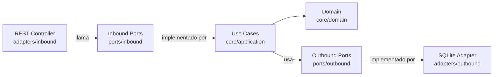
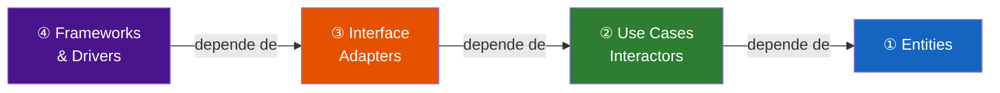
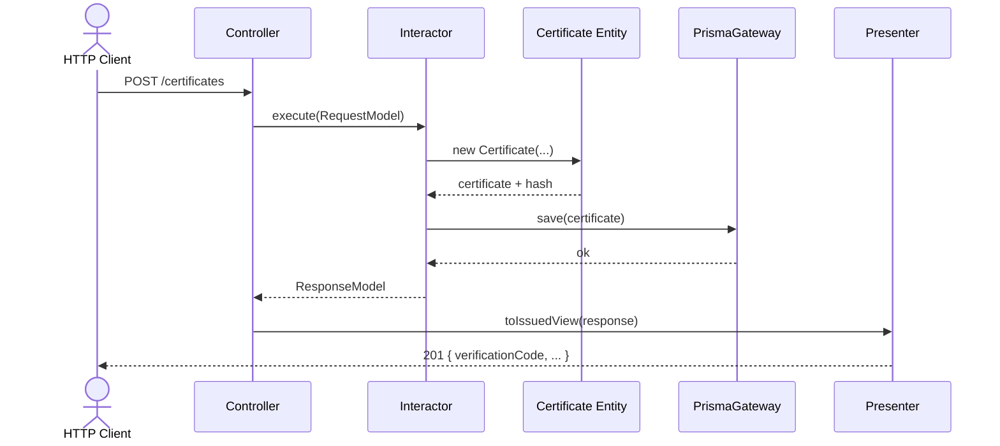
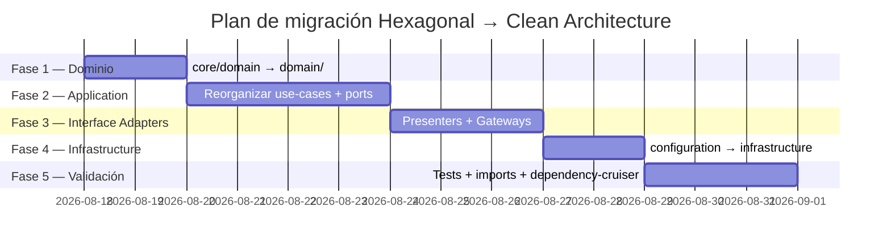

# Migración a Clean Architecture
## CertiChain · Certificados Académicos en Blockchain

**Hexagonal → Clean Architecture**

`TypeScript` · `NestJS` · `Agosto 2026`

---

## ¿Por qué migrar?

- La arquitectura Hexagonal actual es sólida ✅
- Pero al crecer el equipo y el sistema, surgen fricciones:
  - `ports/` crece sin estructura clara
  - Los Use Cases no tienen contratos explícitos de entrada/salida
  - No hay capa de **Presenters**: el Controller formatea el response
  - El código no "grita" las capacidades del sistema

> **Clean Architecture** resuelve cada uno de estos puntos

---

## Las tres arquitecturas de un vistazo

| | Onion | Hexagonal | **Clean** |
|---|---|---|---|
| **Autor** | Palermo (2008) | Cockburn (2005) | Uncle Bob (2012) |
| **Metáfora** | Cebolla | Hexágono | Círculos |
| **Entities vs Use Cases** | ❌ No separa | ❌ No separa | ✅ Explícito |
| **Presenters** | ❌ | ❌ | ✅ |
| **Screaming Arch.** | ❌ | ❌ | ✅ |
| **Boilerplate** | Bajo | Medio | Alto |
| **Testabilidad** | Alta | Alta | Muy alta |

---

## Ventajas y desventajas

| | ✅ Ventajas | ❌ Desventajas |
|---|---|---|
| **Onion** | Simple · Flujo claro | No separa reglas de empresa vs aplicación |
| **Hexagonal** | Múltiples clientes · Infra intercambiable | `ports/` desordenado · Sin Presenters |
| **Clean** | Máxima separación · Ideal equipos grandes | Alto boilerplate · Diseño inicial largo |

---

## ¿Cuándo usar cada una?

**Onion →** CRUD empresarial · equipos pequeños · migrando de MVC

**Hexagonal →** Múltiples clientes (REST + CLI + MQ) · infra intercambiable · proyectos medianos

**Clean →** Sistemas de misión crítica · larga vida útil · equipos grandes · UI puede cambiar radicalmente

---

## Arquitectura Hexagonal — Hoy



- Núcleo: `core/domain` + `core/application`
- Contratos: `ports/inbound` y `ports/outbound`
- Implementaciones: `adapters/`

---

## Clean Architecture — La Regla de Dependencia



> **Ninguna flecha apunta hacia afuera.**
> El código interno jamás menciona algo de una capa exterior.

---

## Nueva estructura de carpetas

```
src/
├── domain/                  ← ① Entities
│   ├── entities/
│   ├── value-objects/
│   └── exceptions/
├── application/             ← ② Use Cases
│   ├── use-cases/
│   │   ├── issue-certificate/
│   │   │   ├── *.interactor.ts
│   │   │   ├── *.input-port.ts
│   │   │   ├── *.request.ts
│   │   │   └── *.response.ts
│   │   └── verify-certificate/ ...
│   └── repositories/        ← Output Ports
├── interface-adapters/      ← ③ Adapters
│   ├── controllers/
│   ├── presenters/  ← NUEVO
│   └── gateways/
└── infrastructure/          ← ④ Frameworks
```

---

## Los 7 cambios clave

| # | Cambio | Origen → Destino |
|---|---|---|
| 1 | Aplanar núcleo | `core/domain/` → `domain/` |
| 2 | Feature-first | `use-cases/*.ts` → `use-cases/feature/*.ts` |
| 3 | Input Ports al use case | `ports/inbound/` → `use-cases/feature/input-port.ts` |
| 4 | Output Ports a application | `ports/outbound/` → `application/repositories/` |
| 5 | **Introducir Presenters** | _(nuevo)_ → `interface-adapters/presenters/` |
| 6 | Adapters → Gateways | `*.adapter.ts` → `*.gateway.ts` |
| 7 | configuration → infra | `configuration/` → `infrastructure/` + `main/` |

---

## Screaming Architecture — Cambio 2

**Antes:** carpeta plana de use cases

```
core/application/use-cases/
  issue-certificate.use-case.ts
  verify-certificate.use-case.ts
  revoke-certificate.use-case.ts
```

**Después:** cada caso de uso es una unidad autónoma

```
application/use-cases/
  issue-certificate/
    issue-certificate.interactor.ts
    issue-certificate.input-port.ts
    issue-certificate.request.ts
    issue-certificate.response.ts
```

> La carpeta "grita" las capacidades del sistema 📢

---

## El Presenter — Cambio 5 (nuevo concepto)

**Antes (Hexagonal):** el Controller construye el response directamente

**Después (Clean):**

```typescript
// interface-adapters/presenters/certificate.presenter.ts
export class CertificatePresenter {
  static toIssuedView(response: IssueCertificateResponse) {
    return {
      verificationCode: response.verificationCode,
      contentHash: response.contentHash,
      status: response.status,
      _links: { verify: `/certificates/${response.verificationCode}/verify` },
    };
  }
}
```

> Si mañana llega GraphQL o gRPC: nuevo Presenter, cero cambios en el Interactor ✅

---

## Flujo completo de una petición



---

## Mapeo de artefactos: actual → futuro

| Archivo actual | Archivo destino |
|---|---|
| `core/domain/entities/certificate.entity.ts` | `domain/entities/certificate.entity.ts` |
| `core/application/use-cases/issue-certificate.use-case.ts` | `application/use-cases/issue-certificate/issue-certificate.interactor.ts` |
| `ports/inbound/issue-certificate.port.ts` | `application/use-cases/issue-certificate/issue-certificate.input-port.ts` |
| `ports/outbound/certificate-repository.port.ts` | `application/repositories/certificate-repository.port.ts` |
| `adapters/outbound/*.adapter.ts` | `interface-adapters/gateways/*.gateway.ts` |
| `configuration/dependency-injection/app.module.ts` | `main/app.module.ts` |

---

## Plan de migración — 5 fases



---

## Validar la Dependency Rule automáticamente

```json
// .dependency-cruiser.json
{
  "forbidden": [
    {
      "name": "domain-no-dep-outward",
      "from": { "path": "^src/domain" },
      "to":   { "path": "^src/(application|interface-adapters|infrastructure)" }
    },
    {
      "name": "application-no-dep-adapters",
      "from": { "path": "^src/application" },
      "to":   { "path": "^src/(interface-adapters|infrastructure)" }
    }
  ]
}
```

```bash
npx depcruise src --config .dependency-cruiser.json
```

---

## Conclusión

| | Hexagonal (hoy) | Clean (destino) |
|---|---|---|
| Estructura | Por tipo (`ports/`, `adapters/`) | Por feature + capa |
| Contratos de use case | Implícitos (solo el puerto inbound) | **Explícitos** (Input/Output Port + Request/Response) |
| Formateo de respuesta | En el Controller | En el **Presenter** |
| Validación de dependencias | Manual | Automatizable con `dependency-cruiser` |

**La lógica no cambia. Solo cambia la organización.**
El dominio y los use cases migran sin modificar una línea de negocio. 🚀

---

# Gracias

**CertiChain** — Arquitectura de Software · Módulo 03

`domain/` → `application/` → `interface-adapters/` → `infrastructure/`

> _"Architecture is about the important stuff. Whatever that is."_
> — Ralph Johnson
